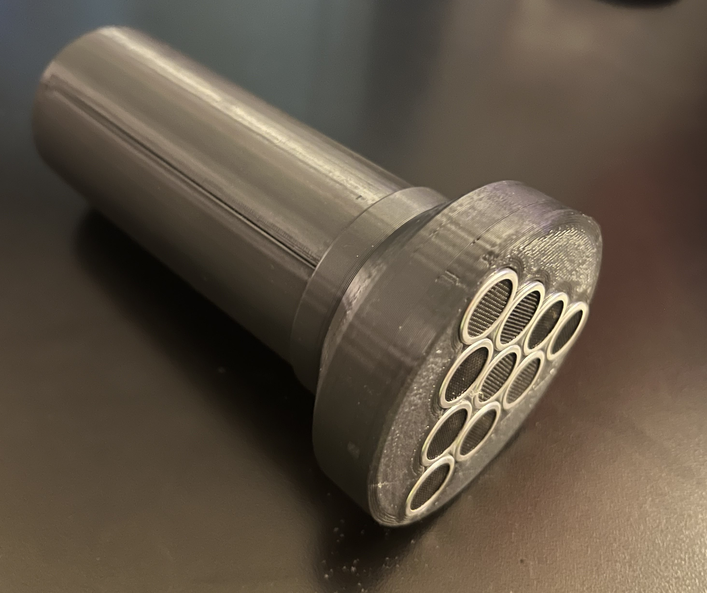

# Ultrasonic Speaker

The Ultrasonic Speaker (a.k.a. Ultrasonic Audio Laser, Audio Spotlight, or Havana Beamgun) is a device that modulates audible sound (20-20kHz) into inaudible high-frequency ultrasonic sound (40-44kHz). Unlike audible sound, ultrasonic waves travel in a narrow, more focused beam which in turn means that they can propagate further with less dispersion. When these ultrasonic waves interact with a surface, the ultrasonic wave demodulates, effectively converting the inaudible modulation back into the original sound, at the **point of interaction**. Check out the following Wikipedia pages[[1]](https://en.wikipedia.org/wiki/Sound_from_ultrasound), [[2]](https://en.wikipedia.org/wiki/Acoustic_wave), [[3]](https://en.wikipedia.org/wiki/Ultrasound) to see the physics of how and why this works. Importantly, this is a frequency modulated (FM) ultrasonic speaker, and not a parametric ultrasonic speaker - which operates on similar but different principles. 

# What This Is / Does

This device is built as a hand-held flashlight/spotlight. Plugging in an audio jack, you can send sound far further than if it were audible at the same volume. If an observer is standing perpendicular to the audio beam, and not directly in the path, they will not hear any audio. It is only at the point of interaction where the audio becomes audible. If you point the device at a wall and continually move it, it will sound like the audio source is moving around on the wall - a very weird sensation.

Here's a fun scenario: Consider 3 people standing in a triangle. If person A is pointing the speaker at person B, person B will hear the audio coming from person A. However, from person C's perspective, they won't hear the audio coming from person A but rather from person B! See this video from [Mark Rober](https://www.youtube.com/watch?v=Zb01RStdzEs&t=396s) for some fun ideas and [their effects](https://www.youtube.com/watch?v=Zb01RStdzEs&t=812s) on people.

# Resources and Acknowledgements

This project was inspired by [CodeParade](https://www.youtube.com/watch?v=aBdVfUnS-pM)'s YouTube video on the topic, and the schematic here takes heavy inspiration from it. Check out his video! There are also a number of other videos on the topic with DIY and professional implementations; check out videos from [Shane](https://www.youtube.com/watch?v=TQOabMOMGoE), [Linus Tech Tips](https://www.youtube.com/watch?v=Fbphhg9ArXw), [Mean Gene Hacks](https://www.youtube.com/watch?v=9hD5FPVSsV0), and [Milan Karakas](https://www.youtube.com/watch?v=jCxfWOJcj1U).

# What You Need

At a bare minimum, you will need the following parts:
 * LM7805 (Voltage Regulator) [[Amazon]](https://www.amazon.com/Voltage-Regulator-Positive-Regulated-Limiting/dp/B08YNNBYB7)
 * 555 Timer [[Amazon]](https://www.amazon.com/Texas-Instruments-NE555P-Single-Precision/dp/B00K243MIQ)
 * L293D (Amplifier / Stepper Motor Driver) [[Amazon]](https://www.amazon.com/BOJACK-16-pin-Stepper-Drivers-Controllers/dp/B09NBQVYLL)
 * Ultrasonic Transducers (T) [[Amazon]](https://www.amazon.com/HiLetgo-Ultrasonic-Sensor-Transceiver-Receiver/dp/B00M2GHG66)
 * 0.1uF, 160pF capacitors
 * 1kΩ, 2kΩ, and 100kΩ resistors
 * Breadboard, Perfboard, or a precut PCB

Nice to have's (to tinker and optimize):
 * Variable pF capacitors [[Amazon]](https://www.amazon.com/Trimmer-Variable-Capacitance-Capacitor-Electronic/dp/B08NTKZGXQ/)
 * Trimmer / Potentiometer
 * Toggle Switch
 * Female Audio Port/Jack
 * LEDs
 * 12v Barrel Jack / Power Supply
 * 9v battery w/ holders

The amortized cost of one device is roughly $15, with the majority of that coming from the transducers. Not bad!

# Schematic

Below is the schematic to build your ultrasonic speaker array. Replace the nice-to-haves as needed. Here are some important wire colors:

* Wires in red are 9-36v lines (larger the voltage, louder the speaker)
* Wires in orange are regulated 5v
* Wires in black are ground
* Wires in blue are offset audio input
  * You can attach a function generator here to test square wave audio. I tested with 440Hz.
  * Attaching an oscilloscope here can verify audio waveforms.
* Wires in white are unamplified modulated audio
  * Attaching an oscilloscope here will show the modulated 555 timer's output.
* Wires in yellow are amplified modulated audio
  * Attaching an oscilloscope here will show the amplified output to the transducer array.

# Important Notes \ Tips

While building my own I encountered a number of issues / challenges. Here are some tips below:
 * I left the audio input open when testing the 555 timing circuit; this should leave a clean and stable output (no modulation). Testing 555 output with active audio signals is near impossible to troubleshoot.
 * The frequency of the 555 timer is extremely sensitive to the 160pF capacitance. 1-2pF is all you need to get outside of the proper frequency / audible range. A variable capacitor is extremely useful here, especially if you plan to transfer your breadboard design to a PCB where circuit capacitance changes.
 * The 2kΩ resistor controls the duty cycle of the timer. 50% is ideal; you can use a trimmer to adjust accordingly.
 * I initially powered my breadboard design off a 12v barrel jack wall outlet. This was extremely noisy, and more so out of the regulator. I added capacitors to smooth out the voltage on both the input and output. 
 * Voltage determines the volume. My handheld design uses 2x 9v batteries. You'll want to check the datasheet of the components you buy to see if it can handle higher voltages. However beware, ultrasonic frequencies, even inaudible, can cause illness or even permanent hearing loss (see [Havana Syndrome](https://en.wikipedia.org/wiki/Havana_syndrome))!
 * The number of transducers determines volume and distance. I used 10 in my design, but you can use as many as you'd like. Using 1 is barely audible in a quiet room. If you plan to use more, ensure the amplifier you use is capable of the current draw.
 * You can technically use transducer receivers as transmitters, but the volume and quality are considerably different/less. See this [video](https://www.youtube.com/watch?v=caQwQBDGglI) by Milan Karakas if you're curious.

# Handheld Build

My handheld version uses a skinny PCB and a 3D printed enclosure. You can see the build steps in the [handheld](https://github.com/dovedevic/Ultrasonic-Speaker/tree/main/handheld) folder. You'll also find STLs there as well, edit to your liking.
