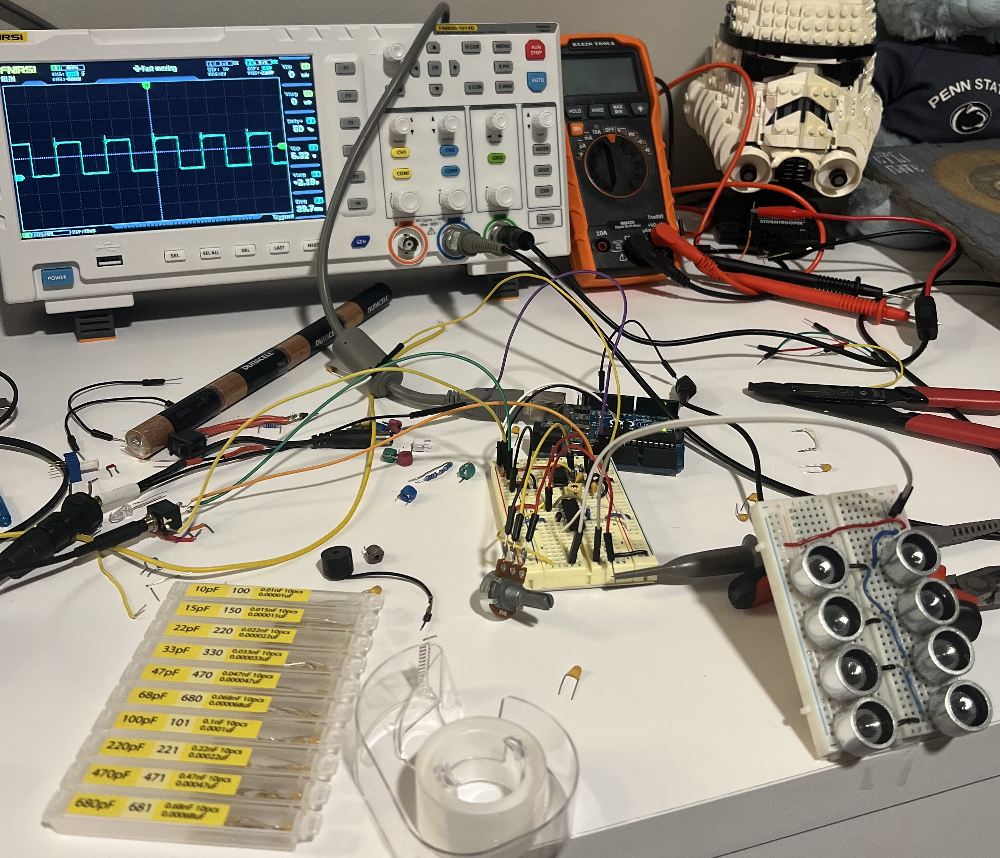

# Handheld Build

Before I made the handheld device, I made sure the breadboard version worked before I transferred everything. This got me in the ballpark for the capacitance and resistance values I needed for the frequency and duty cycle. Using an oscilloscope was mighty useful. I trimmed my circuit to 40kHz.

After making the breadboard design and ensuring it worked, I moved the design onto a skinny PCB. I included a power barrel jack and internal 18v (2x9v batteries) power source, switched by a three-position toggle switch. I exposed certain posts / wires so I could easily troubleshoot and refine the oscillator with my oscilloscope.

I then built a triangular parallel transducer array by hot gluing them together and soldering copper wire to each one. The ends were terminated with female headers so that I can connect it to the board I made earlier. I wanted to make a hexagon / circle, but did not have enough transmitting transducers (although I think I could've gotten away with using receiving transducers). I think the distance between transducers is important, but I don't have any evidence / tests. I glued them as close together as possible.

Using my 3D printer (Crealty Ender 3 Max Neo), I printed an enclosure (head.stl) for the transducer array.

I then made a handle enclosure for the circuit board (handle.stl) and left a void for a 9v battery compartment. My final design had a few in/out ports; a power switch (up for internal power, middle for off, down for external power), a red LED on indicator, a barrel plug for external power, and an input audio jack.

To avoid rattling the board and batteries around, I added adhesive foam to keep everything snug and dampened.

Here is the final handle assembly.

And with cover (cover.stl)

Finally, I attached the transducer array to the board, and pushed the head and handle together, finalizing the build.

Enjoy!
